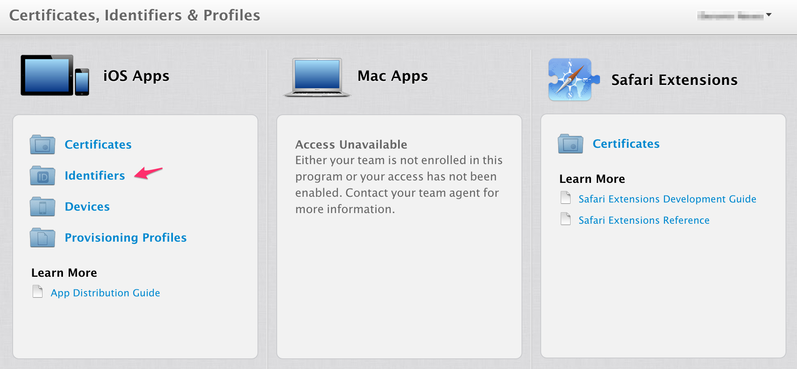
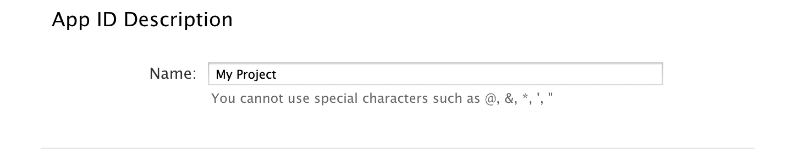
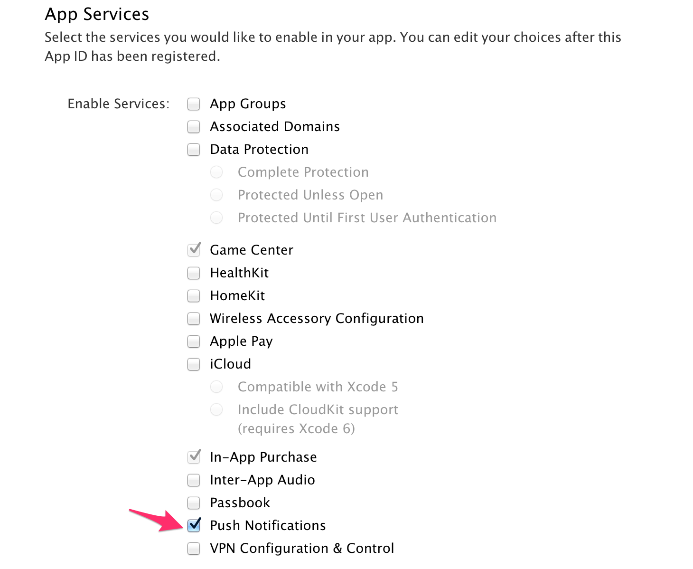
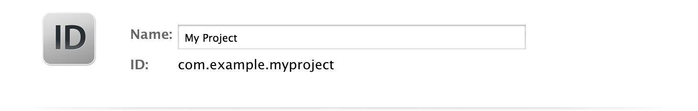
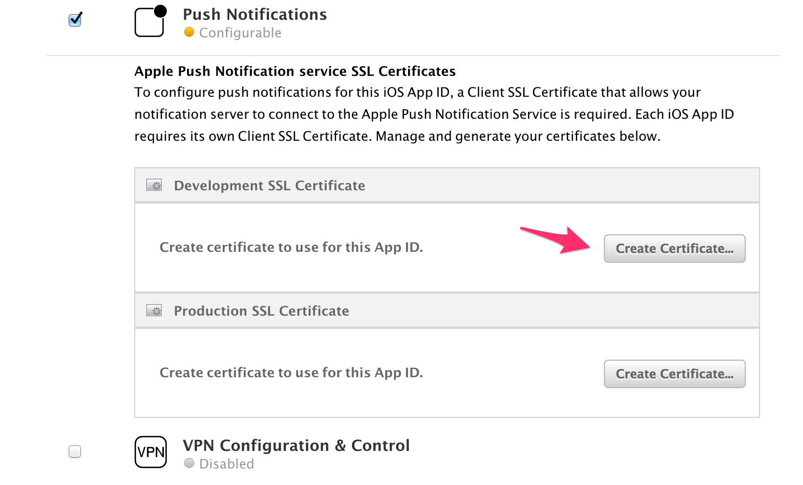
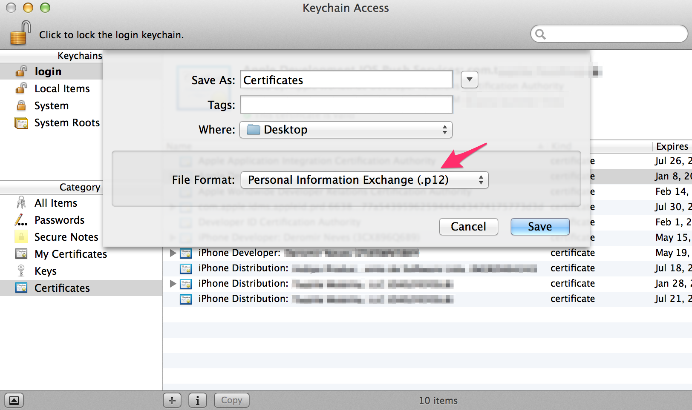
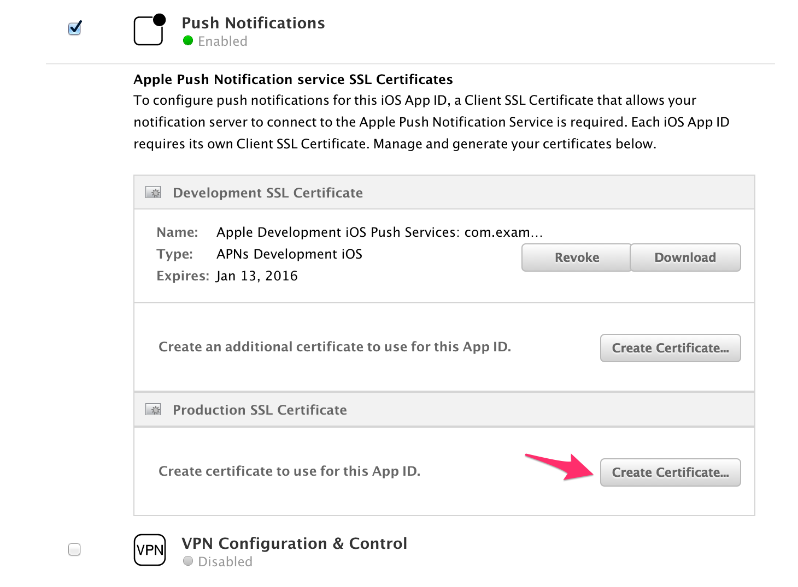

# TQ1 Requirements

This file describes the requirements for any iOS project to be considered ready for the TQ1 services.

## TL;DR

**For development iOS applications you must have:**

- Your application registered at **iOS Developer Portal**.
- **Push Notifications** services enabled.
- An Apple Push Notification service SSL (Sandbox) certificate exported as a **.p12 file**.
- The **password** for the above specified certificate.

**For staging or production iOS applications you must have:**

- Your application registered at **iOS Developer Portal**.
- **Push Notifications** services enabled.
- An Apple Push Notification service SSL (Production) certificate exported as a **.p12 file**.
- The **password** for the above specified certificate.

## iOS

**This guide assumes that:**

- You have an Apple Account and you are registered in an iOS Developers Program. Otherwise you can follow [these instructions](https://developer.apple.com/programs/ios/).

### Development
Then keep going with the following items

1. Access your [iOS Developer Portal](https://developer.apple.com/account/overview.action/).
2. Find the identifiers section.

    
3. In the case you haven't registered your App ID yet, click on the '+' symbol and follow the instructions presented there. Do not forget to enable *Push Notifications*.
    
    
4. Create a Push Certificate.
  1. Select your application on the App IDs list and, then, click on the edit button. You will see all the services available for your application. In *Push Notifications* section, create a development certificate.
    
    
  2. Follow the presented instructions and download the certificate as an *aps_development.cert* file.
  3. Double-click the certificate and add it to your *Keychain*.

5. Export the certificate.
  1. With the Keychain Access application open, click on the certificate and select the option *Export "Apple Development IOS Push Services..."*.
  2. Select the option *Personal Information Exchange (.p12)*.

    
  3. A dialog will appear asking you to provide a **password** for the key.  
  4. Then store securely your **certificate.p12** file.

6. Both the **certificate.p12** and **password** are required for the TQ1 setup.

### Staging and Production
1. For the staging environment setup, use the same application created for development, whereas for production you should create a new one following the previous steps [1-5]
2. The only difference is that you should create an Apple Push Notification service SSL (Production) certificate instead of a Sandbox one.
    
3. Both the **certificate.p12** and **password** are required for the TQ1 setup.
