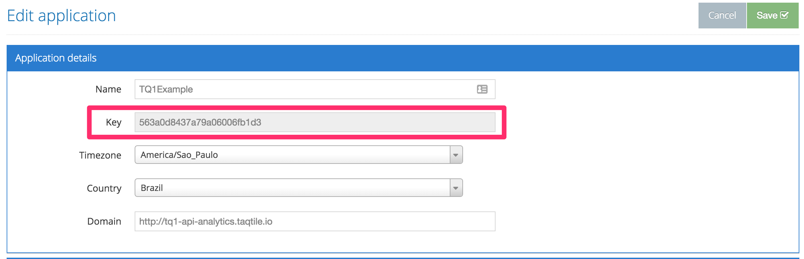

# TQ1 Setup

## Adding Podfile
In order to use TQ1 SDK, you must add the lib by editing your Podfile.

```ruby
target :yourTarget do
  pod 'TQ1SDK', :git => 'https://github.com/tq1/taqtile-sdk-ios.git', :tag => '3.0.13-no-tracking'
end
```

After a `pod install`, the SDK will be ready to use.

## Getting your app key
To use TQ1, you will need an app key, that will identify your application on our server. In order to get this app key, you can login to our admin and:

1. Go to the `Administration` section;
2. Go to the apps menu;
3. Click on the edit button for the desired app;
4. You will see the information on the `Key` field.




## Enabling remote notifications
Before being able to register for remote notifications and for TQ1 to work correctly, you need to enable it on your app configurations:

1. On the app configurations, go to capabilities
2. Enable background modes
3. Check `Location updates`, `Background fetch` and `Remote notifications`


