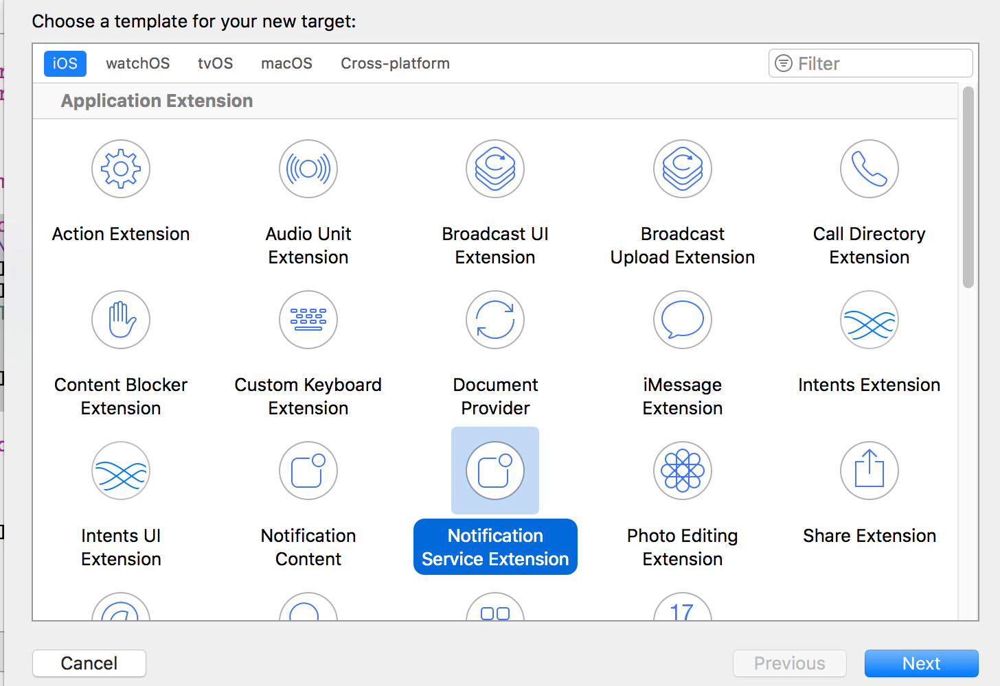
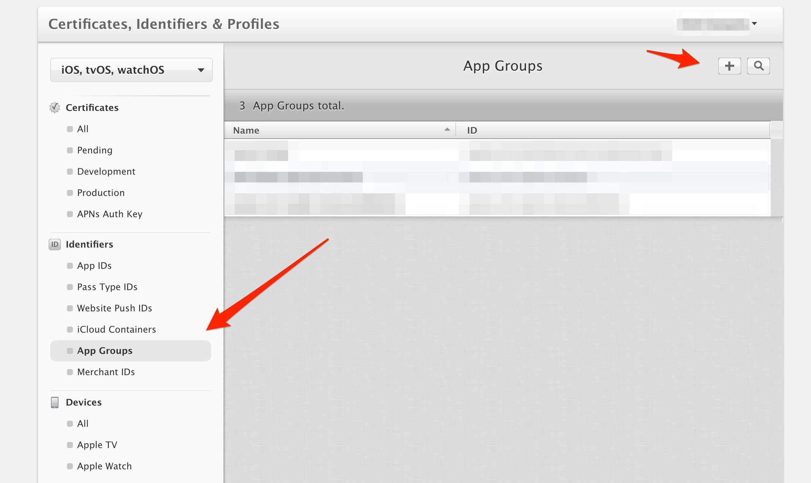
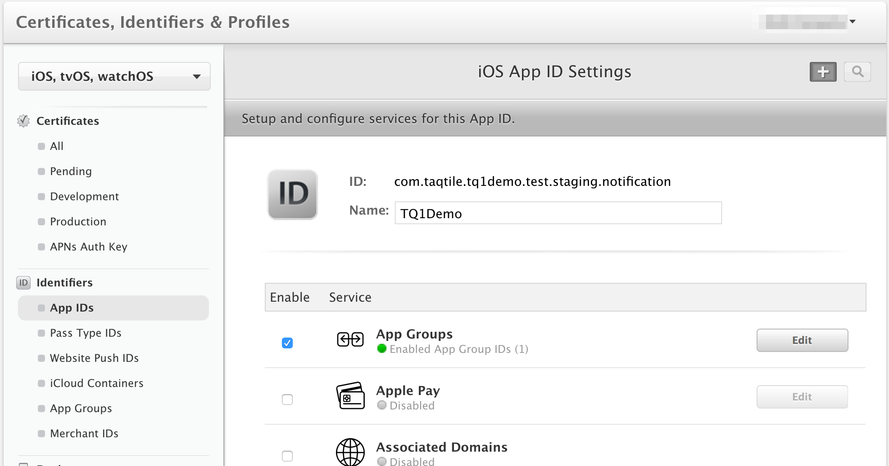
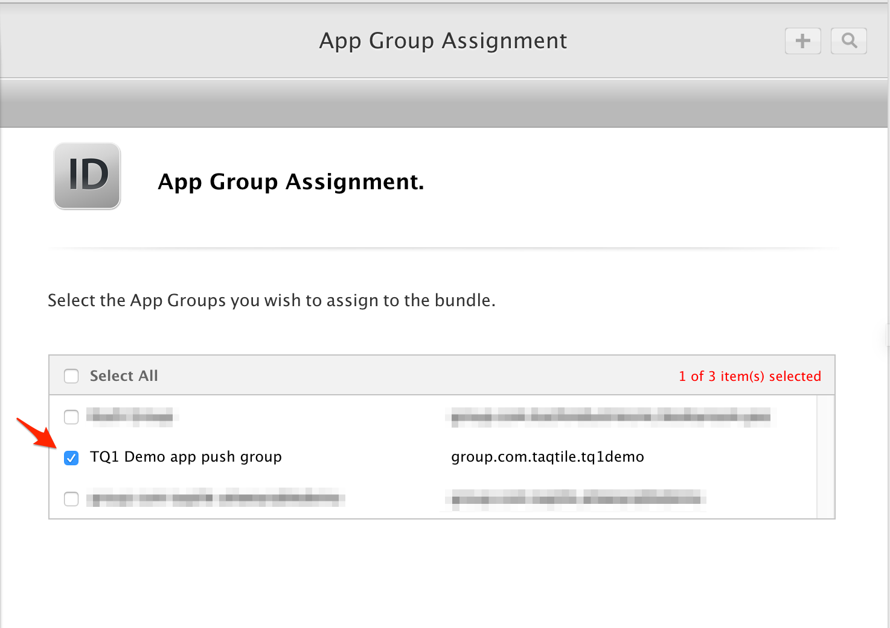
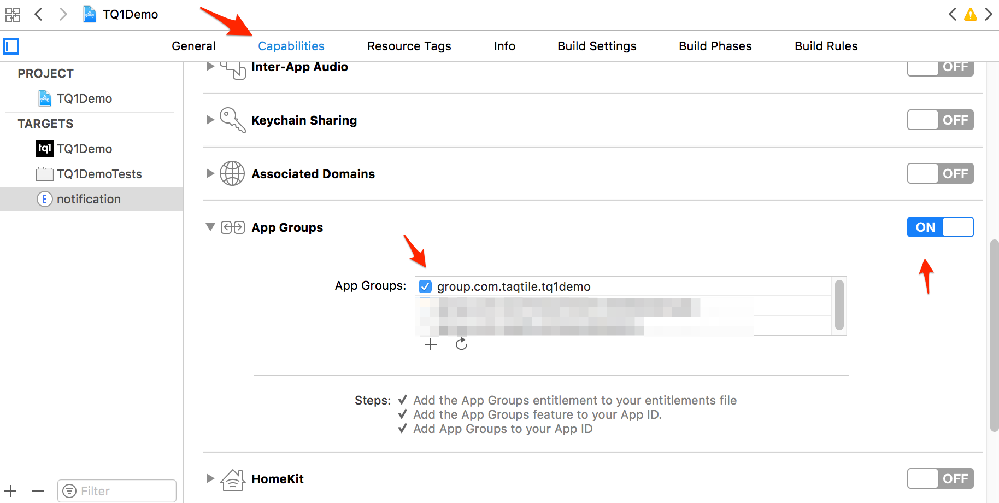

## Handling incoming pushes

Basically there are two classes that handle push notifications: TQ1Inbox and TQ1InboxMessage, both described in 'TQ1Inbox.h'.

Just note that, since there should only exist one TQ1Inbox per app, the correct way to call those methods is by sending the message to the 'shared' return. The 'shared' method will take care of creating an inbox or returning the existing one.

```objectivec
//For example:
[[TQ1Inbox shared] getInboxMessage: @"1234"]
```

Also, one should create a class that handles how the app behaves when a push is received by implementing the TQDelegate protocol, defined in TQ1.h:

```objectivec
@protocol TQDelegate <NSObject>
  - (void)handleForegroundPushNotification:(NSDictionary *)userInfo pushId:(NSString *)pushId;

  - (void)handleBackgroundPushNotification:(NSDictionary *)userInfo pushId:(NSString *)pushId;

  - (void)handleSilentPushNotification:(NSDictionary *)userInfo pushId:(NSString *)pushId;

  -(void)handleCustomActionWithIdentifier:(NSString *)identifier pushId:(NSString *)pushId
@end
```

When the push first arrives, the app may or may not be open, in background, etc; so it's necessary to implement the protocol *TQDelegate* and the *didFinishLaunchingWithOptions* event that will determinate the actions to take in each state. When the application receives a silent notification, only the method `handleSilentPushNotification` is called no matter the application state when it happened. Keep in mind that in this case the user will not be notified.

TQProtocol will describe what happens when the app is open, and in its' implementation it will become necessary to get the received push (to display it, for example). In that case one should use the method *getInboxMessage* inside the protocol's implementation, since they do receive the received push's id:

```objectivec
- (void)handleBackgroundPushNotification:(NSDictionary *)userInfo pushId:(NSString *) pushId
{
    TQ1InboxMessage *receivedPush;
    //Code
    receivedPush = [[[TQ1Inbox] shared] getInboxMessage: pushId];
    //More code
}
```

## Getting the push notification custom content
When you send a custom content along with a push notification, you must first request this content to our server before using it. In order to do this you can use the `retrieveCustomContent` method, like in the following example:

```objectivec
-(void)handleBackgroundPushNotification:(NSDictionary *)userInfo pushId:(NSString *)pushId
{
    TQ1InboxMessage *message = [[TQ1Inbox shared] getInboxMessage:pushId];
    if(!notification.complete)
    {
        [[TQ1Inbox shared] retrieveCustomContent:notification.id completion:^(BOOL success, TQ1InboxMessage *notification)
        {
            //handle notification content
        }];
    }
    else
    {
        //handle notification content
    }
}
```

You can find more details about this method below.

## Handling the notification content
There are three types of notification content:

1. HTML - An HTML to be rendered by the app
2. Link - An URL, usually for showing a page in a web view
3. Tag - Key/value pair, usually for redirecting to pages inside the application

Note that the app is responsible for treating the content, so the possiblities are infinite. Here is an example on how to handle these contents:

```objectivec
// This is for the notifications whose types are custom content (html) and external link (link)
if(notification.type == TQ1InboxMessageTypeHtml || notification.type == TQ1InboxMessageTypeLink)
{
    ContentViewController *ctrl = [[ContentViewController alloc] init];
    ctrl.notification = notification;
    ctrl.notification = [[TQ1Inbox shared] getInboxMessage:notification.id];
    [navController pushViewController:ctrl animated:YES];
}

// This is for notifications whose type is app redirection (tag) - Goes to the view tag indicates
else if(notification.type == TQ1InboxMessageTypeTag)
{
    if([notification.content objectForKey:@"Search"])
    {
        SearchViewController *searchCtrl = [[SearchViewController alloc] init];
        [navController pushViewController:searchCtrl animated:YES];
    }
    if(notification.status == TQ1InboxMessageStatusUnread)
        [[TQ1Inbox shared] markAsRead:notification.id];
}
```

## Handling all received pushes

Now, when there are already received pushes in the inbox and it's necessary to show those, the natural thing to do should be to get all read/unread pushes, and to do that call *getInboxMessages* on the inbox. That method takes a status to do the filtering. The possible status are defined in an enum in the header, but here they are:

```objectivec
typedef enum
{
  TQ1InboxMessageStatusUnread,
  TQ1InboxMessageStatusRead,
  TQ1InboxMessageStatusAll
} TQ1InboxMessageStatus;
```

And naturally, to get, let's say, unread pushes call *getInboxMessages*  with a TQ1InboxMessageStatusUnread parameter:

```objectivec
[[TQ1Inbox shared] getInboxMessages: TQ1InboxMessageStatusUnread]
```

And if you need the read pushes use TQ1InboxMessageStatusRead as the parameter, and to get all use the TQ1InboxMessageStatusAll parameter.

But if it's only necessary to get how many pushes there are in the inbox, there is no necessity to get all the pushes and then count them. In this case simply call *getInboxMessagesCount*. It's faster, it's better, it's cleaner. The method receives the same type of parameter as *getInboxMessages*:

```objectivec
[[TQ1Inbox shared] getInboxMessagesCount: TQ1InboxMessageStatusUnread]
```

Be warned, though, that this returns an "int", not an "NSInteger" nor an "NSNumber".

## Handling a single push

By now the app should be able to list all pushes. Finally, to handle a single push.
There's just a few things to do with a single push.
The first of them is to mark a push as read or unread. So in the view controller, there should be some code as:

```objectivec
if ([[TQ1Inbox shared] markAsRead:pushId]){
  //The push was marked!
}else{
  //The push was not marked...
}
```

The second is to delete the push. It deletes the push from the database:

```objectivec
if ([[TQ1Inbox shared] removeMessage:pushId]){
  //The push was deleted!
}else{
  //The push was not deleted...
}
```

And the third is to retrieve the pushes content. Since pushes and its' contents are not in the same table, it's necessary to retrieve it through the push:

```objectivec
[[TQ1Inbox shared] retrieveCustomContent:pushId completion:^(BOOL success, TQ1InboxMessage *message)
```

The first parameter is the push's id and the second is a block that receives if it was possible to retrieve the content and the TQ1InboxMessage with the retrieved content.

You can also tell the SDK to download the content as soon as the notification arrives via the method call:
```objectivec
[[TQ1Push shared] setDownloadAutomatic: true]
```

Keep in mind that this is only possible when the application is currently running in background. When the user clicks on the notification, you can check whether the content was already downloaded or not by verifying the `complete` field. In the latter case the content should be requested:

```objectivec
TQ1InboxMessage *notification;
if(!notification.complete)
{
  // Request content HERE
}
```

## Removing Multiple Notifications

There is a method available for removing all notifications specified by its `TQ1InboxMessageStatus`: *READ*, *UNREAD* or *ALL*.

```objectivec
[[TQ1Inbox shared] removeMessagesWithStatus: TQ1InboxMessageStatusAll]
```

## Adding Mutable Push Notifications Support

From iOS 10 on, iOS devices are able to handle the push notification content as soon as it arrives, with the new capability, we are able to modify the push notification content and also execute code in order to add it to the push notification database, so notifications that are not opened, are not lost anymore.

In order to do it though, some steps are required. They will be listed below:

- First thing is to add the Notification Service Extension, by going to `File > New > Target...` and selecting the extension. This will generate a new target and you will see that there will be new files in your project. You can view more information about the extension's methods [here](https://developer.apple.com/reference/usernotifications/unnotificationserviceextension).



- You will notice a new target will be added to your project, so you also need to edit your `Podfile`, so TQ1 pod will be installed on the extension as well. For example, if the name of your extension target is `notification`, the lines on `Podfile` will be something like this:

```
target :notification do
    pod 'TQ1SDK', :git => 'https://github.com/tq1/taqtile-sdk-ios.git', :tag => '3.x.x'
end
```

Perform a `pod install` after.

- As the extension and the app have separate databases, in order to use the same one, you need to create an [app group](https://developer.apple.com/library/content/documentation/General/Conceptual/ExtensibilityPG/ExtensionScenarios.html#//apple_ref/doc/uid/TP40014214-CH21-SW1) that will be used by your extension and your app. In order to add app groups you must:
- Create an app group on Apple Developer portal



- Add the app group entitlement on your project (you can do it through Xcode only, but if it doesn't work, do it on developer portal and then add it using Xcode), both on app and extension, selecting the appropriate app group name.





- Important: You will have to regenerate you provisioning profile in order to reflect the new app group, otherwise you will see an error on Xcode.
- Once you have the app group set up, now you must pass the app group name o n TQ1 initialization, by changing the start method to be like:
```objectivec
[[TQ1 shared] startWithKey:@"5787cb42d716ea0700abcdf andAppGroup:@"group.com.yourgroupname"];
```
- Also import TQ1 extension helper on your extension:
```objectivec
#import <TQ1ExtensionHelper.h>
```
- And in order to add the notification to the database as soon as it arrives, you should use the `saveNotification` method, like in the following example:
```objectivec
- (void)didReceiveNotificationRequest:(UNNotificationRequest *)request withContentHandler:(void (^)(UNNotificationContent * _Nonnull))contentHandler {
    self.contentHandler = contentHandler;
    self.bestAttemptContent = [request.content mutableCopy];
    [[TQ1ExtensionHelper shared] saveNotification:self.bestAttemptContent appGroup:@"group.com.yourgroupname"];

    self.contentHandler(self.bestAttemptContent);
}
```
- Remember that you must set the `mutable` flag to true on TQ1 so the push will be sent as mutable and the extension code is executed.
- Once this is done you will notice that even if you do not open the push notification, it will be on the notification list.
